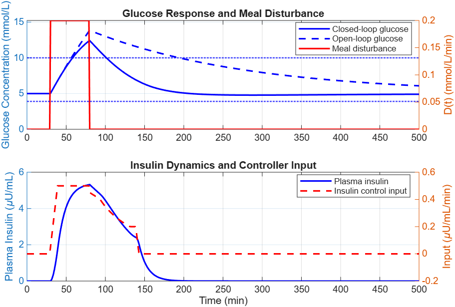
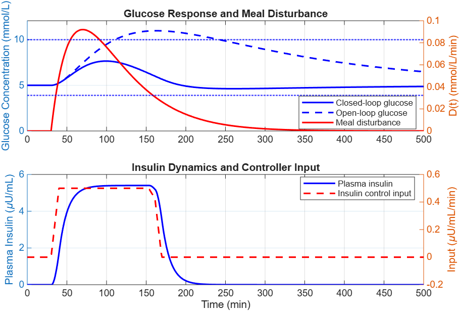
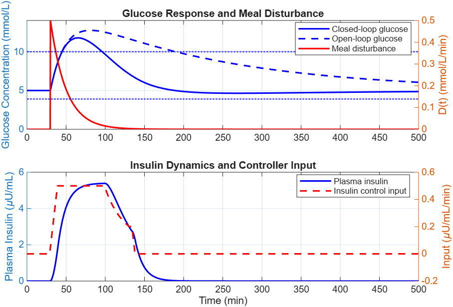
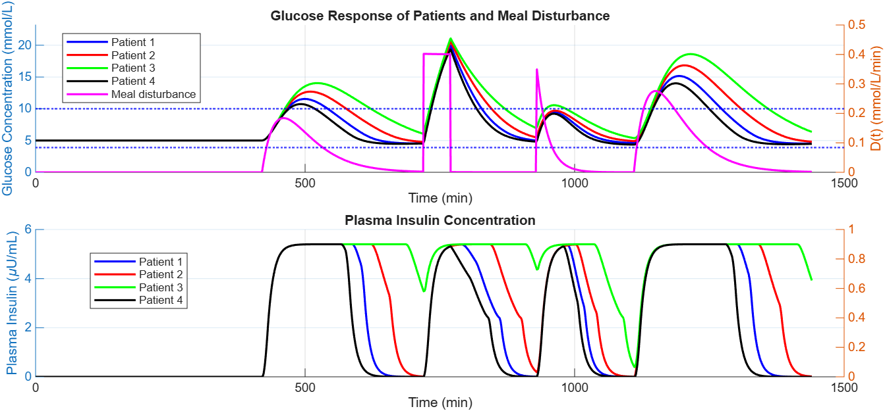

# Artificial Pancreas

MATLAB/Simulink implementation of a model-based artificial pancreas using nonlinear model predictive control (NMPC) for automated insulin delivery.

## Project Structure

```text
ArtificialPancreas/
├── ArtificialPancreas.prj
├── Bergman_Model_Non_Linear.slx
├── CreateNMPC.m
├── BergmanNMPC.m
├── BergmanOutput.m
├── BergmanCustomCost.m
├── BergmanIneqConFcn.m
├── evaluate_AP_performance.m
├── Simulation.m
├── patient1.mat
├── patient2.mat
├── patient3.mat
├── patient4.mat
├── T1step.png
├── T1gamma.png
├── T1exp.png
└── T2.png
```

## Running the Simulation

After opening the project, run the files in the following order:

1. **`CreateNMPC.m`** – creates and configures the NMPC controller.
2. **`Bergman_Model_Non_Linear.slx`** – open and run the Simulink model.
3. **`Simulation.m`** – generates the simulation plots and evaluates the results.

## Selecting the Meal Disturbance

The meal disturbance can be changed by modifying the value of the **Constant** block connected to the input of the **Meal Disturbance** subsystem. This value selects the required disturbance through the Multiport Switch inside the subsystem.

| Switch Value | Meal Disturbance  |
| -----------: | ----------------- |
|          `1` | Gamma-shaped meal |
|          `2` | Step meal         |
|          `3` | Exponential meal  |
|          `4` | Daily meal        |
|          `5` | No meal           |

For the **daily meal** case (`4`), set the Simulink **Stop Time to `1440` minutes** to simulate a full 24-hour period.

For the other meal disturbance cases, set the simulation **Stop Time to `500` minutes**.

## Results

The controller was evaluated using different meal disturbance profiles and patient parameter sets.

### Meal Disturbance Response

The following results show the glucose response of the artificial pancreas under different meal disturbance profiles.

### Step Disturbance



### Gamma-Shaped Disturbance



### Exponential Disturbance



### Inter-Patient Variability

The controller was also evaluated using four different patient parameter sets to assess its performance under variations in insulin sensitivity.



Performance was assessed using metrics including **Time in Range (TIR), Time Above Range (TAR), Time Below Range (TBR), peak glucose, settling time, steady-state error, and total insulin delivered**.

## Note

This project is intended for academic simulation and research purposes. It is not a clinical or medical device.
